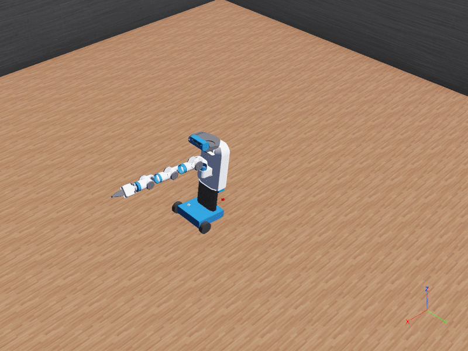

# 🛠️ Fetch Robot in Webots



A Webots simulation of the [Fetch robot](https://fetchrobotics.com/robotics-platforms/fetch-mobile-manipulator/) capable of **navigation** and **manipulation**. 

This setup uses a simplified custom mobile base to reduce computational load while preserving key functionality.

---

## 📦 Features

- ✅ Lightweight base for efficient rendering  
- ✅ Differential drive control via keyboard  
- 🧠 Ready for arm manipulation and navigation logic

---

## 🔧 Setup

### 1. Clone the Fetch URDF (Alternatively Just Find it in `fetch_description` folder)

Using sparse checkout to get only the relevant files:

```bash
git clone --filter=blob:none --sparse https://github.com/IRVLUTD/fetch_ros_IRVL.git
cd fetch_ros_IRVL
git sparse-checkout set fetch_description
git checkout ros1
```

### 2. Convert URDF to Webots PROTO (The Proto File is Also Already Created for You)

Make sure you have the `urdf2webots` tool installed (`pip install urdf2webots`), then:

```bash
python -m urdf2webots.importer \
  --input=fetch_description/robots/fetch.urdf \
  --output=protos/fetch.proto \
  --box-collision \
  --normal
```

```ps
python -m urdf2webots.importer --input=fetch_description/robots/fetch.urdf --output=protos/fetch.proto --box-collision --normal
```
---

## 🎮 Controller Overview

```
# Arrow keys control robot movement
# W:    Forward
# S:  Backward
# A:  Turn Left
# D: Turn Right
```

---

## 🚀 TODO

---

## 🧠 Credits

- URDF: [IRVLUTD/fetch_ros_IRVL](https://github.com/IRVLUTD/fetch_ros_IRVL)  
- Conversion: [`urdf2webots`](https://github.com/cyberbotics/urdf2webots)

---

## 📸 Preview

<p align="center">
  
</p>

---

Let me know if you want to add a section for ROS integration or arm control!